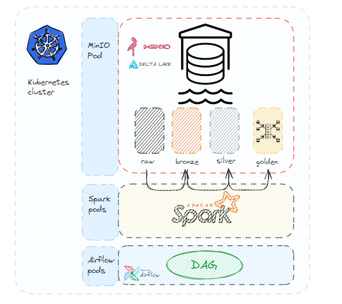

# Spark Pipeline on Kubernetes with Apache Airflow

## Project Description

This project implements a complete **Lakehouse architecture** to process maritime data from **AIS (Automatic Identification System)** using **Apache Spark** on **Kubernetes**. The Lakehouse paradigm combines the flexibility and low cost of data lakes with the data management features of data warehouses, such as ACID transactions and schema enforcement, made possible here with **Delta Lake**.

The pipeline ingests raw AIS data and processes it through a multi-stage ETL workflow, structured in a **bronze-silver-gold** pattern. Each stage is executed as a **Spark job** deployed in **Kubernetes cluster mode** for scalability and resilience. The jobs are orchestrated using **Apache Airflow**, which ensures reliable and scheduled execution.

## Architecture

## Key Features

- **Lakehouse architecture**: Combines the scalability of data lakes with the data reliability of data warehouses.
- **Delta Lake**: Brings ACID transactions, time travel, and schema enforcement to your data lake.
- **Apache Spark on Kubernetes**: Enables distributed, containerized ETL processing.
- **Apache Airflow**: Orchestrates and automates the execution of Spark jobs.
- **MinIO**: Provides S3-compatible object storage for raw and processed data.

## Data Flow (Bronze-Silver-Gold Pipeline)

1. **Bronze Layer**: Ingests raw AIS data without any transformation.
2. **Silver Layer**: Cleans and enriches the data, making it analytics-ready.
3. **Gold Layer**: Transforms the data into business-level tables, modeled for efficient querying.

At the gold layer, data is organized using a **Snowflake schema** modeling approach. This allows for optimized storage and querying, where **dimension tables** and **fact tables** are clearly separated to support analytical use cases such as reporting, dashboards, and trend analysis.

## Workflow

The following Spark jobs are executed in order by Apache Airflow:
1. `ais_raw_to_bronze.py`
2. `ais_bronze_to_silver.py`
3. `ais_silver_to_gold_dimensions.py`
4. `ais_silver_to_gold_fact.py`
5. `delta_to_parquet.py`

Each job runs in **cluster mode** on Kubernetes, using a custom Spark image.

## Setup Instructions

To run this project:

1. Set up a **Kubernetes** cluster (e.g., via Minikube).
2. Install and configure:
   - **MinIO** for S3-compatible object storage.
   - **Apache Airflow** (via Helm) for orchestration.
   - **Spark** with Kubernetes integration for ETL execution.
3. Deploy your Spark jobs and DAGs to the appropriate directories.
